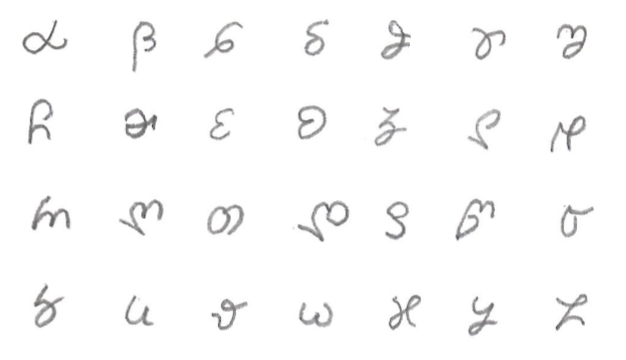

# Maj

Maj is an experimental constructed language, with following attributes:

* Regular - with deterministic reading rules;
* Efficient - short words and simple grammar;
* Familiar - using Latin alphabet and Balkanian sounds;

**Purpose ...**

Maj is designed primarly for artificial rezoning but it has secondary use-cases:

1. Maj is for linguistic studies;
2. Maj is for software engineering;
3. Maj is for chat and entertainment;

**Rad more:** [use case](case.md)

## Alphabet

Maj is using Latin alphabet with modified order and customized pronounciation.

* Maj has a total of 27 letters in the alphabet;
* Maj has deterministic phonetic rules for reading each letter;
* Maj do not use cedilla nor diaressis or accents;

Details: [Maj alphabet](alphabet.md)

**Tool:** 

There is available a tool to convert Maj words into IPA phonetic representation. You can use this tool to write a word you know and see how this is read. After getting familiar with the alphabet this tool is no longer necessary.

External tool: [Maj IPA phonetic converter](https://lingojam.com/MajIPA)

## Script

Maj uses a secondary alphabet for handwriting. This enable Maj users to take quick notes and personal journals using but a pen and a notebook. Script is not designed to be used on a computer but it could be. In the future you will be able to use a stylus to write on a tablet and maybe a software will recognize your letters. Until this is done you can store Maj text using Unicode symbols selected to match Maj script.

</img>

**Notes:**

* Script do not have uppercase letters;
* Script is mapped 1:1 with the Latin print alphabet;
* Script is using same punctuation marks as Latin;

**Example:**

* this is an example written in maj;
* ɛծα σთღև ևღα ζთდα ჺʚβთ ყღ რαʓ;
* ɛծα σთღև ևღα ʓთდα ჺʚβთ ყღ რαუ;

Read more: [Script details](script.md)

**Tools:**

There is a dual conversion tool from Latin to Maj script. This tool will help you to write maj. Once you have learned Maj script you can use the letters to take notes on a notepad.

External tool: [Maj script converter](https://lingojam.com/MajScript)

## Basics

Maj has reduced complexity compared to other Romance languages. Maj is more like English that also uses very short words. Actually some words are shorter in English than Maj. For example verbs: {do, go, be} are shorter than the respective Maj words: {faru, andu, sonu}. 

**Read more about:** [basic grammar](basic.md)

## Details

Advanced grammar rules are explained by:  _word category_

* [Prepositions](preposition.md)
* [Nouns](nouns.md)
* [Verbs](verbs.md)
* [Adverbs](adverbs.md)
* [Adjectives](adjectives.md)

## Lexicon

Maj lexicon is a collection of several spreedshits that we use to host words and expressions with translation in several languages: Spansih, French, Italian, German, Romanian, Latin. This makes Maj a glue language tat can be used to make polyglot translations.

Maj [core elements](https://www.google.com/url?q=https://docs.google.com/spreadsheets/d/e/2PACX-1vTs0cvSYlWttqu7zPxMbiYlWxhN9SosL130JiEn7jqeAyEOxGAr_H7wrRaXrs6oSo-SAFuS2dci1WK6/pubhtml?gid%3D1585147682%26single%3Dfalse&sa=D&ust=1587029543036000) include 3 pages. In te future we will add more pages. 

* alphabet;
* pronouns; 
* numerals;
* symbols;

Basic lexicon is called: [maj bazo](https://docs.google.com/spreadsheets/d/e/2PACX-1vS7pK9vB55081ycoOxikVwUvUuk43HFgAsm7vpmhfCBYQzyUAXASpxmCVtF6qAszPhE7b00IJxejo-R/pubhtml?gid=1162725407&single=false)
and is organized in 3 pages by word length:

* W2 = particles 
* W3 = prepositions 
* W4 = short words

**note:**

There is an advanced Lexicon: "maj-iavo", that is not released yet. 

## Contribution

We accept volunteer work. You do volunteering job for reputation. We have no sponsor for this project. 

1. To review grammar and text;
2. To improve lexicon and examples;
3. To translate Maj grammar in other languages;

If you think Maj has a chanse to be of value in the future then you contribute and learn Maj. We use Google Doc services to host our documentation and GitHub as a backup. On working with these tools is a skill that you will comprehend better working on Maj project.

**Community:**

We use Discord application to chat about Maj. After Maj is consolidated as a useful language we can use Maj for chat about computer programming and valuable projects. Now Maj is in the inception stage but in the future maybe we will have enaugh Maj speakers to have a conversation using Maj. 

Join: [discord invitation](https://discord.gg/ZtusYjf)

