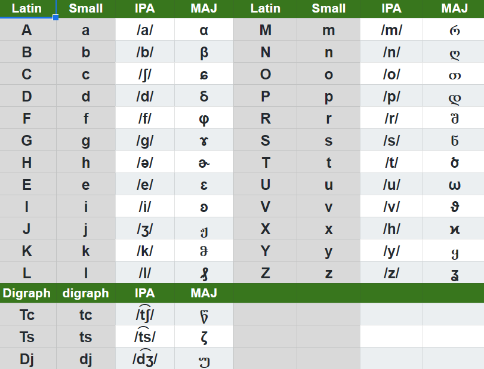

# MAJ Alphabet

Maj alphabet has 24 uppercase letters, 24 lowercase letters, 3 digraphs and 27 handwriting symbols. In the next table each letter is associated with one IPA sound. 

</img>


## Pronunciation

Maj pronunciation is simple and easy to learn. It has well defined rules, that are general and have no exceptions. In maj you do no need to spell words, you need to learn the general reading rules and then you can read any word written in Latin or Maj Script.

**Notes:**

* Maj alphabet has 7, 17 consonants and 3 digraphs in total 27 sounds;
* Maj sounds require healthy tongue, lips, teeth and vocal chords;
* Maj sounds do not require to put your tongue between your teeth;
* Maj sounds do not require inverted tongue tip (retroflex);
* Maj has strong consonants and clear vowels similar to Portuguese;
* Maj sounds have Balcan influence. Not all sounds are Latin;

**Tools:**

Maj has some tools for beginners to learn how to read and write correctly:

* Maj IPA: [phonetics](https://lingojam.com/MajIPA)
* Maj script: [convertor](https://lingojam.com/MajScript)

**Reference:**

For explaining the alphabet pronunciation we have used phonetic symbols: 

* [IPA Org ](http://www.internationalphoneticalphabet.org/ipa-sounds/ipa-chart-with-sounds/) 
* [IPA Wikipedia ](https://en.wikipedia.org/wiki/International_Phonetic_Alphabet_chart)

**Phonetic:**

Phonetic notation has language prefix and is enclosed in double quotes like this:

* Maj phonetic: MAJ:"word";
* IPA phonetic: IPA:"word";
* English phonetic: ENG:"word";

IPA phonetic is used only in Maj documentation. Maj phonetic is used only for training text. For regular chat you can use Latin letters with no accent over and no diaeresis. English phonetic can be used to compare Maj with English and to understand Maj better.


## Vowels

Maj has 7 vowels: { a e i o u y ə }:

method      |front    |central    |back 
------------|---------|-----------|---------
close       |i        |y          |u      
close mid   |e        |           |o
mid         |         |ə          |
open        |a        |           |

**Origin:**

Next 5 vowels are pronounced like in Italian and Romanian languages not like in English nor German:

* Letter `a`  is open central, like `a` in `car`;
* Letter `e`  is close-mid front, like `e`  in `melon`;
* Letter `i`  is close front, like `ee` in `geese`;
* Letter `o`  is close-mid back, like `o` in `document`;
* Letter `u`  is close back, like `oo` in `soon`;
* Letter `ə`  is mid central, like `o` in baron;

**Letter `y`:** Is close central, un-rounded vowel. IPA symbol for this sound is actually /y/. This sound is very different than English sound `y`. It is very similar to sound `i` in words "still" or "director". A similar sound is IPA:/ɨ/. Maj do not use this letter very often but it is present in some words given as examples: "myna" = hand and "zyna" = fairy.

Learn more: [listening](https://en.wikipedia.org/wiki/Close_central_unrounded_vowel)

**Letter `h`:** In Maj this letter is very different from other languages.  This letter is pronounced `ə` and is never silent. If it is present, it has to be read. Th original sound /h/ is produced using letter x or X. Actually letter X si pronounced IPA: /x/. 

Since on QUERTY KEYBOARD there is not `ə`we have decided to use "h" instead. We have inspired this decision from Greek where H is actually pronounced "i". Also there is no point to have a silent letter in Maj.

Learn more: [listening](https://en.wikipedia.org/wiki/Voiced_labio-velar_approximant)

## Tone and accent

Maj vowels can be pronounced with one of two tones: _Low Tone_ and _Higher Tone_: 

**word ending**

* If a word is ending with space, "." or ";" you can use lower tone for last vowel;
* If a word is ending with comma, "," or "?" you should use higher tone for last vowel;

**sentence ending**

Symbols: "!" and "?" are altering the last vowel of the last word. 

* Using "!" will make a lower tone for last vowel;
* Using "?" will make a higher tone for last vowel;

For question mark: You should pronounce a longer vowel and gliding the tone from lower to higher level. Wehn the word is ending with a consonant, the vowel in front of the last consonant is modified.

**accent:**

Maj words have a very soft accent on the first syllable. Apostroph can modify the accent position from first to last syllable. This accent gliding is used in verb conjugation, imperative and negation. I will not insis on Maj accent since Maj is for typing not for speaking. However if you need to speack Maj try to learn this simple rule.

## Consonants

Maj is using 19 consonants:

method   | bilabial| labio dental | alveolar | valar | post alveolar | glottal 
---------|---------|--------------|----------|-------|---------------|----------
plosive  | p,b     |              | t, d     | k, g  |               |
nasal    | m       |              | n        |       |               |
trill    |         |              | r        |       |               | 
fricative|         | f,v          | s,z      |       | c, j          | x
lateral  |         |              | l        |       |               |
affricate|         |              | ts, tc   |       | dj            |


Most consonants are similar to IPA but some are different;

* Letter  `b`  is voiced, plosive, bilabial like `b` in "boss";
* Letter  `p`  is voiceless, plosive, bilabial like `p` in "pin";
* Letter  `t`  is voiceless, plosive, alveolar like `t` in "test";
* Letter  `d`  is voiced, plosive, alveolar like `d` in "door";
* Letter  `k`  is voiceless velar stop like "k" in "kitten" or "c" in "color";
* Letter  `m`  is nasal, bilabial, like `m` in "mule";
* Letter  `n`  is alveolar, nasal, like `n` in "novel";
* Letter  `r`  is trilled, similar to sound `r` in "rocket"
* Letter  `f`  is voiceless, lavio-dental frivative like `f` in "frog";
* Letter  `v`  is voiced labio-dental fricative , similar to `v` in "voice";
* Letter  `s`  is fricative alveolar like `s` in "snake";
* Letter  `z`  is alveolar-dental, vibrated, similar to `z` in "zoo";
* Letter  `l`  is liquid, alveolar, like `l` in "lord";
* Letter  `c`  is voiceless post-alveolar affricate like "ch" in "church";
* Letter  `g`  is voiced velar fricative like `gu` in "guitar";
* Letter  `j`  is viuced fricative alveolar, like `s` in "pleasure";
* Letter  `x`  is voiced fricative glottal like "h" in "happy";

## Difficult sounds

Next you will learn the rules to make more difficult Maj sounds. These sounds are strange and not found in original Latin. So we have found some controversial sollutions how to map the letters to get maximum range of sounds with only 24 letters. In total Maj has 27 distinctive sounds. So three sounds are not mapped 1:1 with Letin letters.

**Digraphs**

Most frequent sounds are associate with letters:

* Letter `c` sounds `ʃ` or `ʂ` like `sh` in  "fashion": 
[listen](https://en.wikipedia.org/wiki/Voiceless_postalveolar_fricative)
* Digraph `tc` sounds `t͡ʃ` or ʈ͡ʂ like `ch` in  "peach": 
[listen](https://en.wikipedia.org/wiki/Voiceless_postalveolar_affricate)
* Digraph `ts` sounds `t͡s` like `ts` in  "cats": 
[listen](https://en.wikipedia.org/wiki/Voiceless_alveolar_affricate)
* Group `dj` sounds `d͡ʒ` like `g` in  "giraffe": 
[listen](https://en.wikipedia.org/wiki/Voiced_postalveolar_affricate)
* Group `ks` sound like `x` in word "sex"

**Examples:** 
Phonetic writing is quoted using IPA: notation 

* Cava => IPA:"ʃava"   = horse    
* djia => IPA:"d͡ʒia"   = day

**Digraph: ts**

Maj digraph "ts" sounds like `t͡s` in word ENG:"cats". To make this sound you put you tang in "t" position and make a pitch sound "s" instead. Group `ts` will make words a bit longer but this is the prace we pay to avoid ussage of cedila.

**IPA practice**
* tseba = ENG: "cerebellum" => IPA: "t͡seba"
* tsiga = ENG: "cigarette"  => IPA: "t͡siga"

**Modified: k**

Maj letter "k" is plosive-valear. It may be pronounced like "c" in "culture" or "k" in "karate". Notice "k" is a very frequent letter in Maj. It replaces letter Latin letters "q" and "c". Letter Q is actually not prezent at all in Maj.

**examples:**

* akua = "water";
* tcoka = "chocolate";

**Trilled: r**

Letter "r" is trill-alveolar like in Romanian and Russian. It is strong like double "rr" in English. To produce this sound, your tongue is relaxed and the tip of tongue taps the roof of the mouth several times. Some Romanian children never learn this letter corectly and sound like Americans. 


**Modified: C**

In Maj, "C" is used to create IPA sound /ʃ/ " and sound /t͡ʃ/. When digraph "tc" replace digraph "ch" in words like "chin" or "chicken" or "peach". We use this technique to free letter "h" to be used for something else.

Learn more:[listen](https://en.wikipedia.org/wiki/Voiceless_postalveolar_affricate)

* tcika = "girl" is read like IPA: "t͡ʃika";
* tcoka = "chocolate" is read like IPA: "t͡ʃoka";

**Modified: x**

Letters `x` sounds like: `sh` in `sheep`. To prodice this sound you must softly press the middle of the tongue on the roof top of your mouth and produce a fricative whispering sound. In most other Romance languages this sound is "cs" but Maj has repurpose this letter to improve language efficiency. 

Learn more:[listen](https://en.wikipedia.org/wiki/Voiceless_postalveolar_fricative)

## Clusters

A clusters represents a group of two consonants. Maj is using cluster in many words using pattern: CCV or VCCV. These words are  a bit difficult to pronounce therefore we preffer this method for rare words.

**Rules:**

* we do not use same letter twice to make clusters;
* some combinations can not be pronounced therefore are descouraged;
* clusters of 3 consonants are forbidden in Maj;

**Examples**

After a short analysis, these clusters are usable in Maj words:

```
br bs bj
ck cf cr cl cm cn cp ct
kl km kn kr ks kt kv kz
dl dm dr dv gr tl tm tr 
fl fr ft fj
lb lk ld lf lg lj lm ln lp lq ls lt lv lz
nb nk nd nf ng nh nj nl nm nq ns nt nv nz
mf mn mp ms mz mx
pl pr ps pt px 
rb rk rd rf rg rh rl rm rn rq rp rs rt rz
sc sf sl sm sn sp sr st sv 
vr zb zd zg zm zn zv
jb jk jd jl jm jn jr js jt jv 
gn gl gm gr gv gs
``` 

## Diphthongs

Two vowels combined together into one cluster are called diphthongs.

x |a  |e  |i  |o  |u  | y | h 
--|---|---|---|---|---|---|---
a | · |ae |ai |ao |au |ay | ah
e |ea | · |ei |eo |eu |ey | eh
i |ia |ie | . |jo |iu |iy | ih
o |oa |oe |oi | · |ou |oy | oh
u |ua |ue |ui |uo |.  |uy | uh
y |ya |ye |iy |yo |yu | . | yh
h |ha |he |hi |ho |hu |hy | .    

**Note:** We do not duplicate vowels in mak for any purpose.

 
## Letter weight 

Sounds are more or less difficult to make. This is call _weight_ and can be used to calculate _pronounciation complexity_ for a word. More frequent words should have a lower complexity and a reduce weight. More complex words are also more expensive. 

Weight |Sounds
-------|----------------------------------------
  1    |aeiouhy 
  2    |lmnfs
  3    |bkdpt 
  4    |vjzc
  5    |xgr


## Cost of typing

The cost of typing on keyboard is different than speaking the word:

Cost |  Letter
-----|-------------------------------------------
  1  |asdfjklgh
  2  |qweruiop
  3  |zxcvm 
  4  |tbyn

**penalty:**

There is an extra cost of 2 for same hand consecutive letters.

Hand   | Letter
-------|------------------------------------------
left   |asdfgqwertzxcvb
right  |hjklyuiopnm  

## Average cost

For computing an average cost, we consider 3 functions:

* tcos: cost of typing one word on keyboard 
* rcos: cost of reading and speaking with your voice
* wcos: cost of hand writing the word 

We use a priority average function, to evaluate average cost:

```
function cmaj(w as string) as integer
  cost = rcos(w)*3 + tcos(w)*2 + wcos(w) 
  cmaj  = cost/6
end function
```

CMaj function is available for open office macro, and is used in Lexicon:NOV tab to create new words.

[macro.bas](tools/macro.bas)

## Word divergence:

Some people may pronounce letters in the wrong way. Therefore word composition must consider to replace these letters to make the language lighter. When two words have these letters in same position one other letter must be different, otherwise the words are in conflict, one must be modified.

light | heavy
------|----------
b     | v
l     | r
j     | c
h     | y

Other considerations when making words is the coda. If a word is different from another word only by coda, and this is a vowel then one of the words must be changed or the words must be related. 

## Algorithm

We use this algorithm to compute cost of words:

* for double consonants we add extra cost of 3
* for double vowel we add extra cost of 1

[macro.bas](tools/macro.bas)

## Total cost

Using this algorithm total cost for 542 words:

* 4085  in Maj 
* 7231  in English 
* 7642  in Spanish
* 8793  in Franch
* 7696  in Romanian
* 9423  in German

Read next: [numerals](numerals.md)
