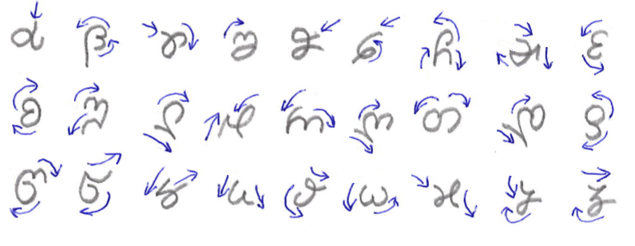

## Maj script

Maj script is a cursive alphabet with letters from Georgian, Greek and Latin. It is a secondary alphabet that can only be written by hand. We have no font for Maj script and you can not use it with a keyboard.

* Maj letters are continuous, single stroke;
* Maj script is for writing with stylus on tablet;
* Maj script is mapped almost 1:1 with Lating alphabet;

## Writing direction

To write a Maj letter correctly you must start with movement 1, then you continue with movement 2 and do not lift your pen until you finish the letter. Some letters have loops and some have full stops with returns. The return is back over the line, or slightly off forming a sharp angle. 

</img>

**note:**
In the previous picture I have used an existing font that approximate Maj letters. When you write, the only requirement is to start from the correct position and make a shape that looks like the one we have used above. It does not have to be identical. Each person can customize its own style. The condition is to be consistent. Do the letter in the same way every time so that one who read can get used with your heandwriting style.

## Examples of words in Maj

**example:**

* io voru cu jedo un novo iana fezo!
* ʚთ ϑთწև ɕև უɛშთ ևღ ღთϑთ ʚαღα ჵɛʓთ!
* I wish to everyone a happy new year!

**phonetic:**

Next picture has IPA pronounciation for each Maj letter:

</img>

Audio file: [Maj-28-letters.mp3](Maj-28-letters.mp3)

<audio controls preload="auto"> 
    <source src="Maj-28-letters.mp3" />    
</audio>

**Read next about the Latin:** [alphabet](alphabet.md)
