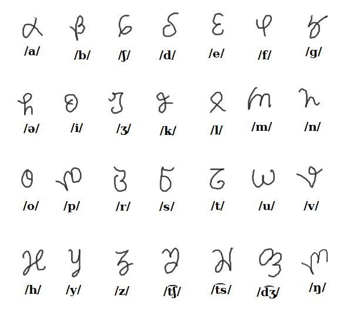
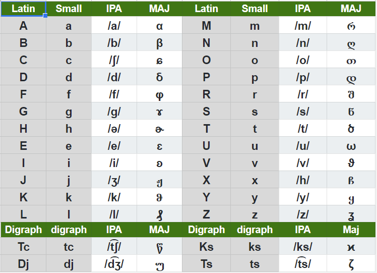

## Maj script

Maj script is a cursive alphabet with letters from Georgian, Greek and Latin. It is a secondary alphabet that can only be written by hand. We have no font for Maj script and you can not use it with a keyboard.

* Maj letters are continuous, single stroke;
* Maj script is for writing with stylus on tablet;
* Maj script is mapped almost 1:1 with Lating alphabet;

## Writing direction

To write a Maj letter correctly you must start with correct position. Some letters have loops and some have full stops with returns. The return is back over the line, or slightly off forming a sharp angle. Never lift your pen until you finish the letter.  

</img>

**notes:**
In the previous picture I have used a crayon but you can write with a pencil or with a ballpen. Maj is not designed for paint brush. Each person can customize its own style. However you should be consistent. Do the letter in the same way every time. 

Maj is a slow weiting system, never rush when you write something using Maj Script. If you need to write fast then you use a keyboard and you use Latin alphanet. Maj script is only for heandwriting therefore you can not be fast. 

## Phonetic

Next picture has IPA pronounciation for each Maj letter:

</img>

Audio file: [Maj-28-letters.mp3](Maj-28-letters.mp3)

<audio controls preload="auto"> 
    <source src="Maj-alphabet-reform.mp3" />    
</audio>

## Using Maj script

Maj script is not depending on Maj language. You can use Maj script to write secret messages in any language that can be reduced to Maj alphabet. Next is an example of poetry in Romanian written with with Maj rules and Maj script. I guess a Romanian will understend this text and be able to learn from it the Maj alphabet.

```
a fost o dath ka nitcodath
din rude mari ymparhtecti
o prea frumoash fath"
```
```
ci era una la phrintsi
ci myndrh-n toate tcele
kum e fetcoara yntre sfintsi
ci luna yntre stele"
```
```
trhind yn tcerkul vostru strymt
norokul vh petretce,
ci eu yn lumea mea mh simt
nemuritor ci retce."
```
Fragment is from poetry "Luceafărul" by Mihai Eminescu.


**Read next about the Latin:** [alphabet](alphabet.md)
