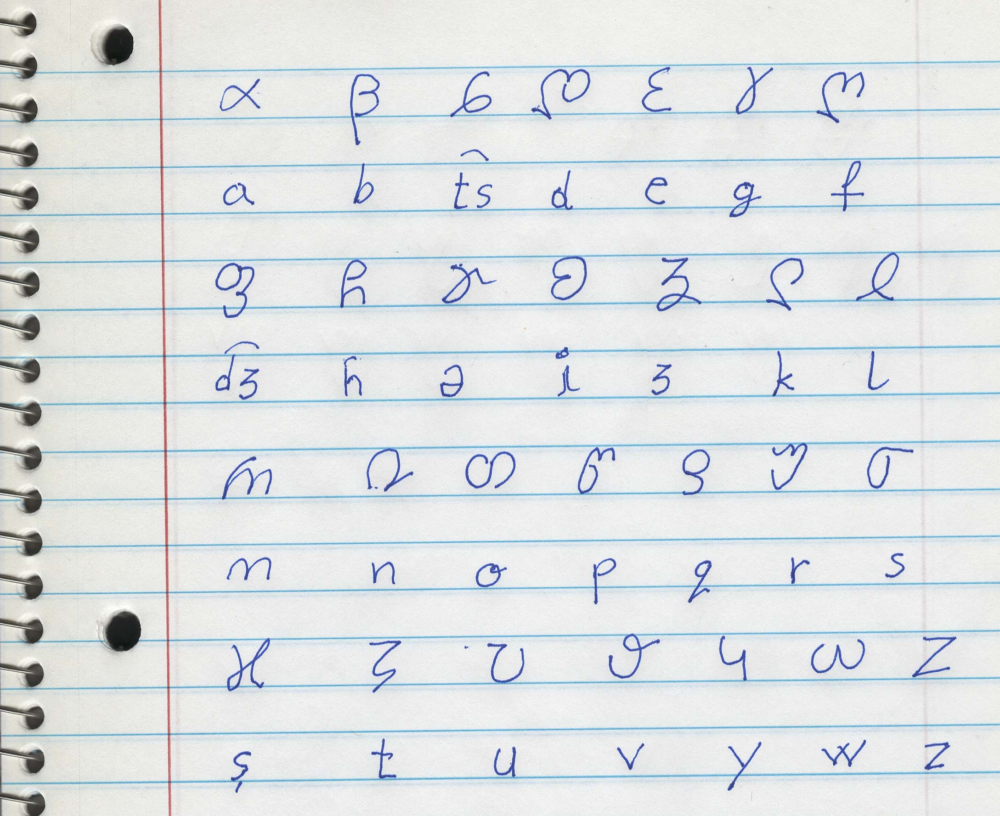

## Maj script

Maj script is a creole alphabet with letters from Georgian, Greek and Latin. It has 28 letters in contrast to Latin alphabet who has only 26 letters. 

* Maj letters are continuous, single strike;
* Maj script is for writing with stylus on tablet;
* Maj script is mapped almost 1:1 with Lating alphabet;

## Writing direction

To write a Maj letter you start with move 1, then you continue with move 2 and do not lift your pen until you finish the letter. Some letters have loops and some have full stops with returns. The return is never 100% over like it is on some Latin letters. It is slightly off.

</img>

## Cost of writing

The more movements a letter has the more expensive it is. The cost of writing can be calculated using 3 classes depending on letter difficulty. We have selected this cost so that most frequent letters are less expensive while more rare laters are a bit more expensive.

Cost |  Letter
-----|----------------------------
  1  |abcgouneilsv
  2  |qtwymkzə
  3  |jxrhdfpk

Const of writing can be used in an algorithms to evaluate word complexity during word creation. Names can be invented in Maj so this function could be used to establish popular names for persons and places.

**Tools:**  
  
* [Maj Script Convertor](https://lingojam.com/MajScript)
* [IPA alphabet](http://www.internationalphoneticalphabet.org/ipa-sounds/ipa-chart-with-sounds/)

## Examples of words in Maj

**example:**

1. იυ.կუდυ.ɕυ.ƍʚრα.ωɛჲ.ɕυ.რαჺα.
1. nu yrdu cu qima wel cu maka;
1. we go to cinema or to supermarket;

**notes:**

* In Maj script, words are separated by a dot instead of space; 
* It is good to add one space after the dot, before the next letter;

**phonetic:**

Next picture has IPA pronounciation for each Maj letter:

</img>

And this is done. Great!

Read next about the Latin: [alphabet](alphabet.md)
