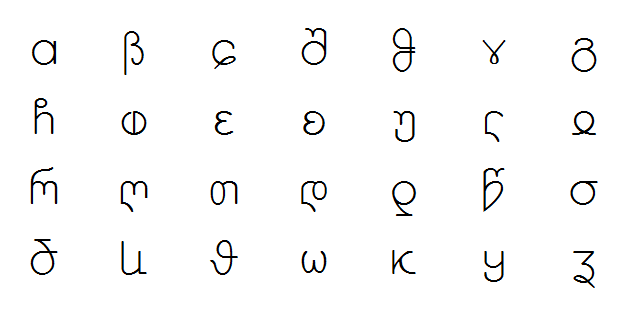
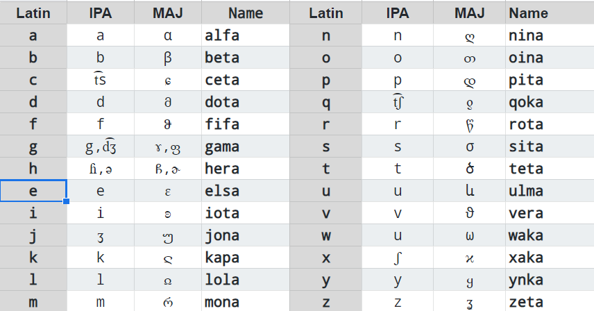

## Maj script

Maj script is a cursive alphabet with letters from Georgian, Greek and Latin. It is a secondary alphabet that can only be written by hand. We have no font for Maj script and you can not use it with a keyboard.

* Maj letters are continuous, single stroke;
* Maj script is for writing with stylus on tablet;
* Maj script is mapped almost 1:1 with Lating alphabet;

## Font

There is not yet a font for Maj script. We have reused different unicode symbols:

```
α  β  ɕ  შ  ჵ  ɤ  გ  ჩ  ⱷ  ɛ  ʚ  უ  ჺ  ჲ  რ  ღ  თ  დ  ƍ  წ  σ  ծ  և  ϑ  ω  ϰ  ყ  ʓ  
```

**Demo: Everson Mono**

</img>


## Writing direction

To write a Maj letter correctly you must start with movement 1, then you continue with movement 2 and do not lift your pen until you finish the letter. Some letters have loops and some have full stops with returns. The return is back over the line, or slightly off forming a sharp angle.

</img>


## Handwriting test 

The letters in next picture are not perfect. However if you start the letter from the correct point and do the directions correctly the writing will be probably good enough for reading by other persons.

</img>

## Cost of writing

The more movements a letter has the more expensive it is. The cost of writing can be calculated using 3 classes depending on letter difficulty. We have selected this cost so that most frequent letters are less expensive while more rare laters are a bit more expensive.

Cost |  Letter
-----|----------------------------
  1  |abcdgsv
  2  |eiktlqouwyz
  3  |mnjxrhfp

Const of writing can be used in an algorithms to evaluate word complexity during word creation. Names can be invented in Maj so this function could be used to establish popular names for persons and places.

**Tools:**  
  
* [Maj Script Convertor](https://lingojam.com/MajScript)
* [IPA alphabet](http://www.internationalphoneticalphabet.org/ipa-sounds/ipa-chart-with-sounds/)

## Examples of words in Maj

**example:**

*. ʚთ.შთწև.ɕև.ծთშთ.რևშთ.ღთϑთ.αღთ.ჵɛʓთ!
*. io doru cu todo mudo novo ano fezo!
*. I wish to the entire world happy new year!

**notes:**

* In Maj script, words are separated by a dot or a comma; 
* Comma after words ending with a vowel, indicate a higher tone;
* Dot after words ending with a vowel, indicate a low tone;

**phonetic:**

Next picture has IPA pronounciation for each Maj letter:

</img>

Audio file: [Maj-28-letters.mp3](Maj-28-letters.mp3)

<audio controls preload="auto"> 
    <source src="Maj-28-letters.mp3" />    
</audio>


**Read next about the Latin:** [alphabet](alphabet.md)
